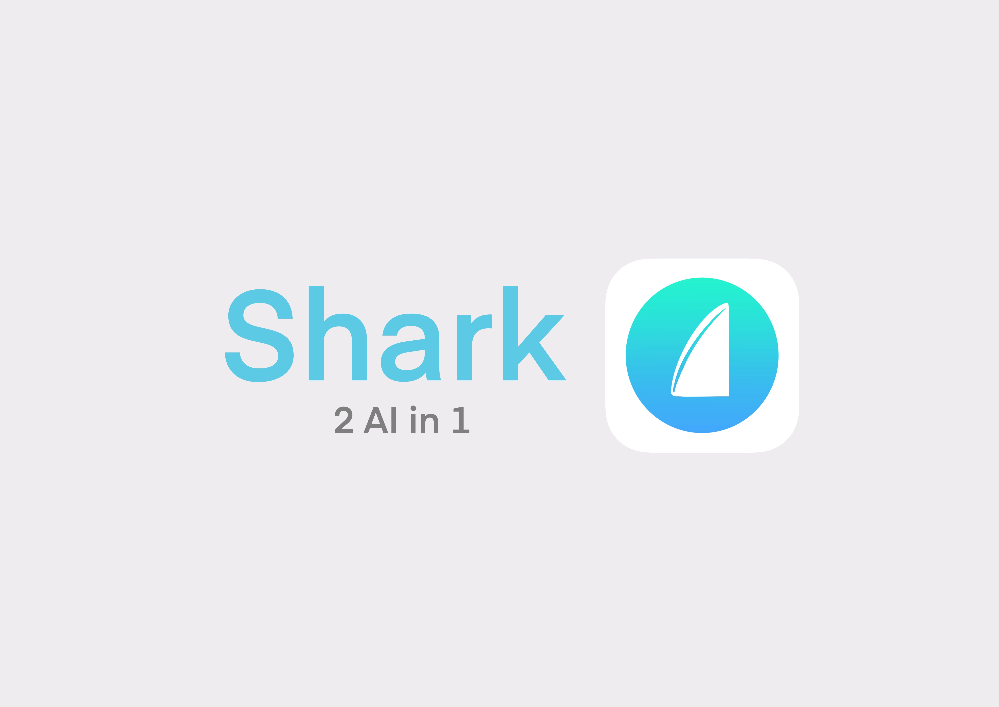
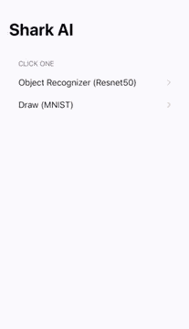
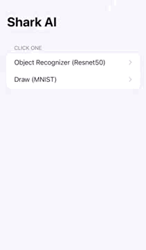

# The name is Shark. 

> 📱 🦈 2 AI App in 1 go.

[]()
[]()
[](LICENSE.md)



## Features
- 🌇 Image Detection (Resnet50) 

>

- ✏️ Number Recognition (MNISTClassifier)

>

## Installation
The only thing you need to know is that, you don't need to install any .mlmodels. But if you do, go ahead and check out [Apple's Machine Learning Models](https://developer.apple.com/machine-learning/models/).
```bash
Use Resnet50 and MNISTClassifier
```

## Contributing 
✅ Pull requests are welcome. For major changes, please open an issue first to discuss what you would like to change.

Please make sure to update tests as appropriate. 👌

1. Fork it (<https://github.com/jeremygautama/Shark-AI/fork>)
2. Create your feature branch (`git checkout -b feature/fooBar`)
3. Commit your changes (`git commit -am 'Add some fooBar'`)
4. Push to the branch (`git push origin feature/fooBar`)
5. Create a new Pull Request

## Support
⭐️ Your **star** means so much. Giving a **star** helps motivate me to make more epic projects that you'll enjoy!

📢 Help spread the word!!!

## License
📄✔️ The best license. [MIT](https://github.com/jeremygautama/Shark-AI/blob/master/LICENSE.md) License.

## Author
👤 Jeremy Gautama

## Contact
🥨 If you have any questions, feel free to [email](mailto:mail.jeremygautama@gmail.com) me or to visit my [website](https://jeremygautama.github.io). Thanks!

